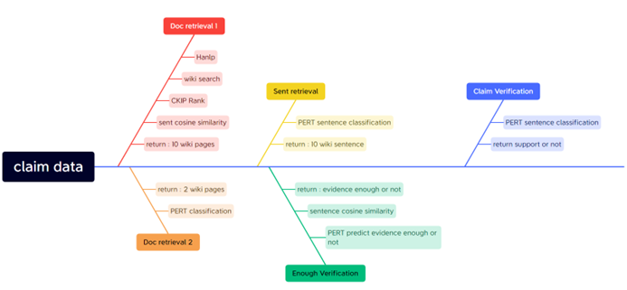
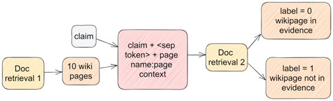
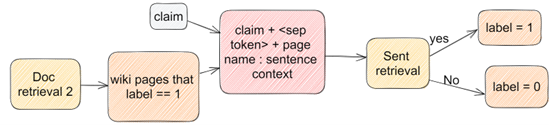
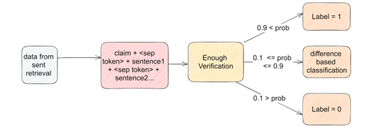
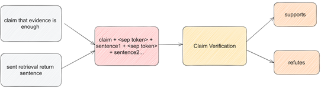
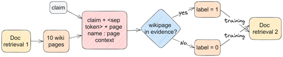
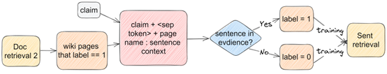
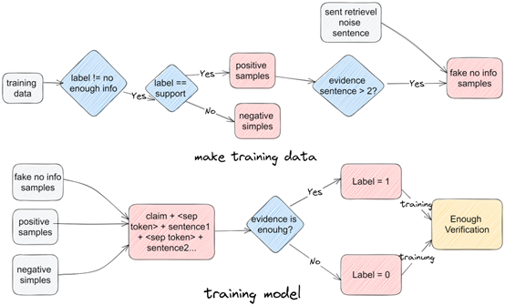
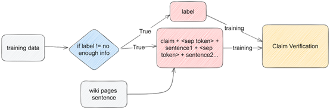

# AICUP-2023-MIG
for [AICUP 2023 真相只有一個: 事實文字檢索與查核競賽](https://tbrain.trendmicro.com.tw/Competitions/Details/28) code  
隊伍：TEAM_3076  
隊員：馬行遠(隊長)、李韋杰  
Private leaderboard：0.710069 / Rank 4  

## Introduction
本次競賽為事實文字檢索與查核競賽，主要目標為判斷輸入的文章是否為真實的事實，並且判斷文章中的謠言是否為真實的事實。
我們的方法主要分為四個部分：
1. 使用wikisearch與[PERT large](https://huggingface.co/hfl/chinese-pert-large)模型進行文章的篩選與分類  
2. 使用PERT large模型進行句子的分類
3. 使用PERT large模型進行證據足夠性的判斷
4. 使用PERT large模型進行謠言的判斷
我們的模型主要使用的是huggingface的transformers，並且使用accelerate進行訓練加速。
## 流程與模型設計  
<p align="center">
  
</p>

### Doc retrieval 1：  
#### 1. 第一階段：  
將claim的資料經過hanlp抽出名詞子句後讓wiki search套件回傳相關的頁面。此時每一個名詞子句都會有十篇頁面，因此需要先經過篩選取回十篇最相關的维基頁面。
篩選方式為運用中研院開發的[CKIP-transformers](https://github.com/ckiplab/ckip-transformers)中的ALBERT-base-ws、ALBERT-base-pos進行斷詞與名詞抽取再加上ALBERT-base-ner對hanlp名詞子句進行名詞抽取，並計算這些名詞出現的樹進行排序。選用名詞子句而非claim的主要原因是因為CKIP在前後文不同的情況下會有不同的抽取結果，為了取得所有可能的名詞，抽取多個名詞子句的recall會比較高。
#### 2. 第二階段：
第二階段將會把前十篇的所有句子利用哈爾濱工業大學大學的[roberta-large預訓練模型](https://huggingface.co/hfl/chinese-roberta-wwm-ext-large)與clam進行cosine similarity 取出最接近的十篇進行wiki的搜尋後重複以上步驟。會執行第二階段的原因則是為了處理一些只會在頁面中的資訊才會找到的關鍵證據，所以才會多做一層的搜索。
#### 3. 第三階段：
將兩次搜尋結果進行合併在一起後取前十作為candidates回傳。
### Doc retrieval 2：
<p align="center">
  
</p>

經過前面都搜尋後獲得了十篇维基頁面，將十篇文章的page name 與 claim運用BERT的sep token組合在一起成：claim + sep token +　page name : page context若該page為目標page則對應label為1，否則對應為0。 
### Sent retrieval ：
<p align="center">
  
</p>

將Doc retrieval 2回傳pages的sentence加上pagename與claim做pair，並使用sep token將兩者連接，對應結構如下:claim + sep token + page name : sentence context。若該sentence為目標sentence則對應label為1，否則為0。
### Enough Verification：
<p align="center">
  
</p>

用前面步驟抽取出top 10 的 sentence，並將claim對應evidence sentence做pair，其結構如下: claim + sep token + sentence1 + sep token + sentence2...。若該組pair包含目標sentence則對應label為1亦為該pair擁有足夠的資訊量判斷，否則對應為0，threshold = 0.5, 如果 0.1<= prob <=0.9, then diff based。
### difference based classification：
為了加強Enough Verification模型的預測結果我們將claim與train data的claim利用哈爾濱工業大學的roBERTalarge  (Cui et al., 2020)做cosine similarity尋找相似的claim協助是否enough。，如果相似的claim有evidence 那詢問的claim也應該要有evidence，若沒有資訊則依靠先前的Enough Verification的prob進行分類。  
### Claim Verification：
<p align="center">
  
</p>

如果經過上述模型的判斷後，evidence確定是有足夠的，那就會交由這個模型進行判斷claim是否正確。我們會將claim依照先前sent retrieval的機率進行排序，並取最多五個句子作為pair的元素。 輸入結構如下: claim + sep token + sentence1 + sep token + sentence2...，若組pair對應的標記為supports則label=0，若該組pair對應的標記為refutes則label=1。

## Training data and model design:　
***以下模型統一使用哈爾濱工業大學的[PERT large](https://huggingface.co/hfl/chinese-pert-large)*** 
### Doc retrieval 2模型:
<center>
<p align="center">
  
</p>

#### Doc retrieval 2 Hyperparameter
|Hyperparameter|	value	|Hyperparameter|	value|
|---|---|---|---|
|max_len|	512|	weight_decay|	0.01|
|truncation|	True	|batch_size	|8|
|learning_rate	|1e-5	|epoch	|2|
|save_for_best_metric|	recall|	threshold|	0.5|
|kfold	|5	|kfold |vote	|majority|


</center>

### Sent retrieval模型:
<center>
<p align="center">
  
</p>

#### Sent retrieval Hyperparameter
|Hyperparameter|	value	|Hyperparameter|	value|
|---|---|---|---|
|max_len|	512|	weight_decay|	0.01|
|truncation|	True	|batch_size	|8|
|learning_rate	|1e-5	|epoch	|5|
|save_for_best_metric|	recall|	negative sample ratio|	0.3|
|kfold	|5	|kfold |vote	|majority|


</center>


### Enough Verification模型:
<center>
<p align="center">
  
</p>

#### Enough Verification Hyperparameter
|Hyperparameter|	value	|Hyperparameter|	value|
|---|---|---|---|
|max_len|	512|	weight_decay|	0.01|
|truncation|	True	|batch_size	|8|
|learning_rate	|1e-5	|epoch	|5|
|save_for_best_metric|	F1|	threshold|	0.5|
|kfold	|5	|kfold |vote	|majority|

*特殊調整：threshold = 0.5, if 0.1<= prob <=0.9, then diff based

</center>

### Claim Verification模型:
<center>

<p align="center">
  
</p>

#### Claim Verification Hyperparameter
|Hyperparameter|	value	|Hyperparameter|	value|
|---|---|---|---|
|max_len|	512|	weight_decay|	0.01|
|truncation|	True	|batch_size	|8|
|learning_rate	|1e-5	|epoch	|5|
|save_for_best_metric|	F1|	threshold|	0.5|
|kfold	|5	|kfold |vote	|majority|

</center>

## File tree:
```bash
├── README.md
├── bert_main.py
├── doc1
├── kf_predict_claim.sh
├── kf_predict_enough.sh
├── kf_predict_page.sh
├── kf_predict_sent.sh
├── kf_train_claim.sh
├── kf_train_enough.sh
├── kf_train_page.sh
├── kf_train_sent.sh
├── pipeline.sh
├── postprocess
├── predict.sh
├── preprocess
├── requirements.txt
├── submissions
├── train.sh
└── utils.py
```
## START:
### step1 : download our code:
``` bash
git clone https://github.com/markpony100/AICUP-2023-MIG.git
```
### step2 : install requirements
CUDA = 11.1
please install conda and use following code to set up environments
``` bash
conda create -n AICUP2023
conda activate AICUP2023
conda install pytorch torchvision torchaudio cudatoolkit=11.1 -c pytorch-lts -c nvidia
pip3 install -r requirements.txt
pip3 install accelerate -U
```
### step3 : please download our data_and_model.zip, unzip and put it in main directory
[data and model checkpoint](https://CSMIG.quickconnect.to/d/s/tuUh6pvfGgeQ596AutCmef6wWfOK2FM5/4ov2FFGow2wOV3K_wTAPq1JpsVgSfgdI-PL9gAzD2gAo)

### step4 : please run our shell
``` bash
bash pipeline.sh
```
## train the model: 
``` bash:
bash train.sh
```